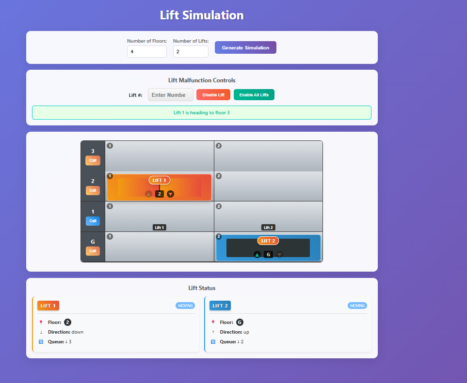
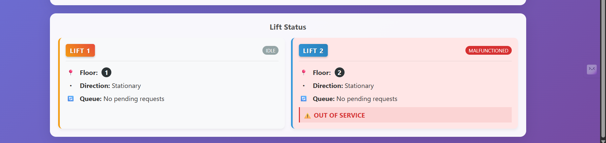
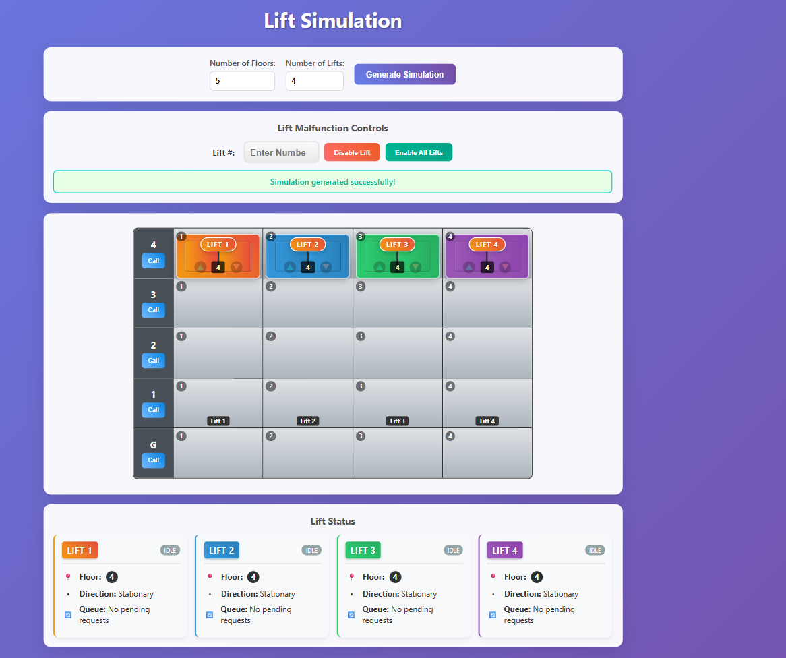

# Lift-Simulation

Create a web app where you can simulate lift mechanics for a client.

## Features

1. Configure the number of floors (2-10) and lifts (1-5)
2. Interactive UI with visual depictions of lifts and call buttons on floors
3. Advanced lift scheduling algorithm for efficient operation
4. Smooth animations for lift movement and door operations
5. Visual and audio feedback for lift operations
6. Floor indicators and direction indicators inside lifts
7. Lift malfunction simulation with emergency controls
8. Detailed status display for each lift
9. Mobile responsive design
10. Sound effects for enhanced user experience (when sound files are available)

## Requirements (Completed)

1. Have a page where you input the number of floors and lifts from the user ✓
2. An interactive UI is generated, where we have visual depictions of lifts and buttons on floors ✓
3. Upon clicking a particular button on the floor, a lift goes to that floor ✓

### Milestone 1 (Completed)

- Data store that contains the state of your application data ✓
- JS Engine that is the controller for which lift goes where ✓
- Dumb UI that responds to controller's commands ✓

### Milestone 2 (Completed)

- Lift having doors open in 2.5s, then closing in another 2.5s ✓
- Lift moving at 2s per floor ✓
- Lift stopping at every floor where it was called ✓
- Mobile friendly design ✓

### Enhanced Features (New)

- Smooth animations with cubic-bezier transitions
- Improved lift allocation algorithm using SCAN method
- Visual feedback for lift arrival and movement
- Sound effects for buttons, doors, movement, and arrival
- Floor and direction indicators inside lifts
- Enhanced status display with visual cues

## UI 

